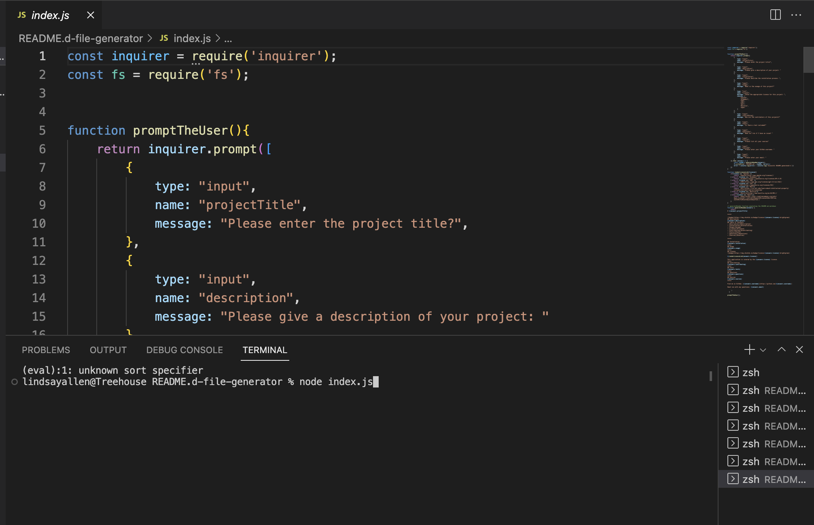
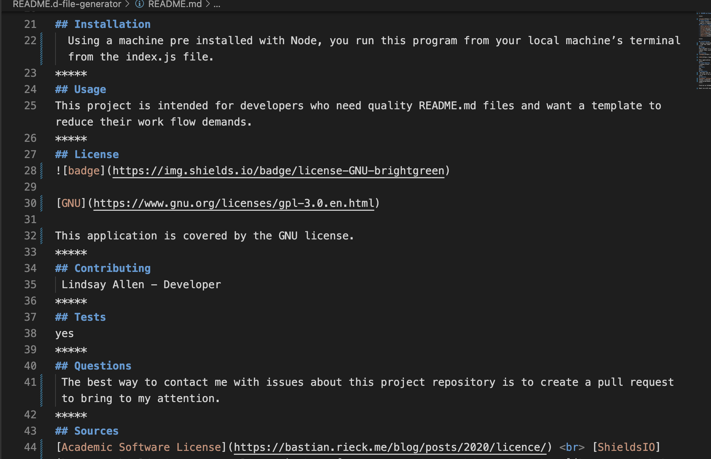

# README.md Generator

*****
  

## Description
 I have created a README.md generator that will produce professional README.md files that can be used as a template for efficient work flows.
## Table of Contents
- [Description](#description)
- [Installation](#installation)
- [Usage](#usage)
- [License](#license)
- [Contributing](#contributing)
- [Tests](#tests)
- [Questions](#questions)
- [Sources](#sources)

*****

## Installation
  Using a machine pre installed with Node, you run this program from your local machine’s terminal from the index.js file. 
*****
## Usage
This project is intended for developers who need quality README.md files and want a template to reduce their work flow demands. 

*****
## License

[GNU](https://www.gnu.org/licenses/gpl-3.0.en.html)

This application is covered by the GNU license. 
*****
## Contributing
Lindsay Allen - Developer
*****
## Tests

*****
## Questions
The best way to contact me with issues about this project repository is to create a pull request to bring to my attention.
*****
## Sources
 [Academic Software License](https://bastian.rieck.me/blog/posts/2020/licence/)   [ShieldsIO](https://shields.io/category/license)    [My New Favorite Markdown Cheatsheet](https://github.cadam-p/markdown-here/wiki/Markdown-Cheatsheet)
*****

Find me on GitHub: [katsaymeow](https://github.com/katsaymeow)

Email me with any questions: me@katsaymeow

    